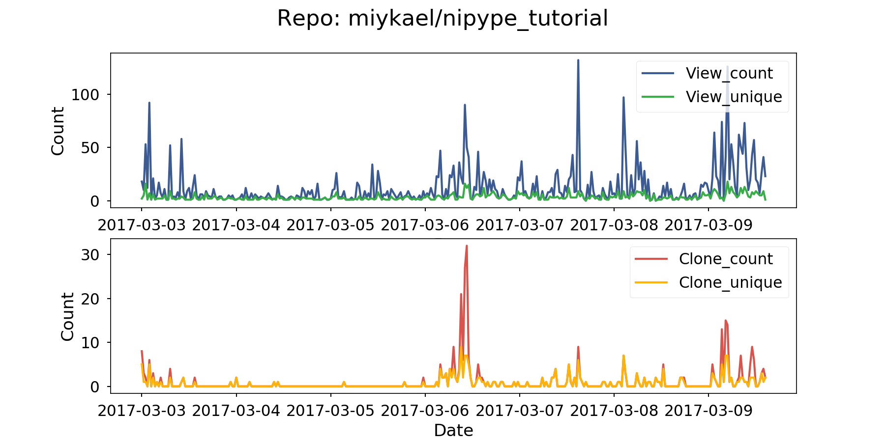

# Github Traffic Information

The script ``traffic_info_github.py`` extracts the current traffic information of a specific or all of your repos. Github only provides information about view and clone count for the last 14 days. This script tries to bypass this restrictuion by accumulating the traffic information in a local tsv file. Therefore, if you run the script at least once every 14 days you can store the full traffic information.

Once all new traffic information are collected, an overview graph for the whole tracking period will be generated for each repo:

**Note**: The script is based on [nchah's github-traffic-stats.py](https://github.com/nchah/github-traffic-stats), and I want to thank him for his work!

# How to run the script

The script expects two mandatory and one optional input:

    1. `username`: Github username (mandatory)
    2. `password`: Github password (mandatory)
    3. `reponame`: Name of repo (optional, default: ALL)

So, if you want to collect tracking information for all of your repos, use:

    python traffic_info_github.py username password

If you want to only track one specific repo use:

    python traffic_info_github.py username password reponame

# Set up daily collection

I'm not really familiar with all the ways to run this script daily, or at least every 14 days. I'm sure there's a cool fancy way to run it somehow "online" on a server/cloud. If you know how, please tell me. I'm happy to learn it, too.

My solution was to run the script at system boot up on my local Ubunut machine. To do so, open `Startup Applications` and create a new entry (`Add`) with the following command:

    /path/to/your/python/bin/ipython /path/to/script/traffic_info_github.py username password
